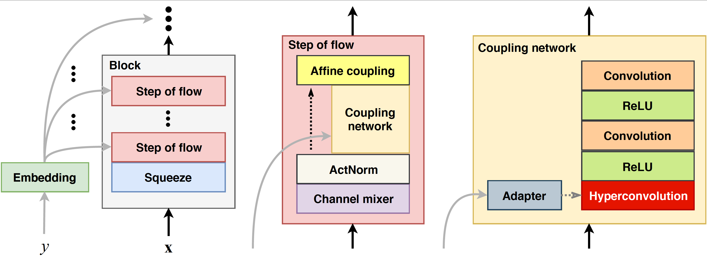

# Blow Conversions

This is the accompanying page of the paper "Blow: a single-scale hyperconditioned flow for non-parallel raw-audio voice conversion", where we show some audio conversion examples.

---

## Summary

End-to-end models for raw audio generation are a challenge, specially if they have to work with non-parallel data, which is a desirable setup in many situations. Voice conversion, in which a model has to impersonate a speaker in a recording, is one of those situations. In this paper, we propose Blow, a single-scale normalizing flow using hypernetwork conditioning to perform many-to-many voice conversion between raw audio. Blow is trained end-to-end, with non-parallel data, on a frame-by-frame basis using a single speaker identifier. We show that Blow compares favorably to existing flow-based architectures and other competitive baselines, obtaining improvements in both objective and subjective scores. We further assess the impact of its main components with an ablation study, and quantify a number of properties like the necessary amount of training data or the preference for source or target speakers.

---

## Examples

### Example 1

Source:
<html>
  <audio controls>
    <source src="p361_01198.wav">
  </audio>
</html>

Target:
<html>
  <audio controls>
    <source src="p245_05025.wav">
  </audio>
</html>

Conversion:
<html>
  <audio controls>
    <source src="p361_01198_to_p245.wav">
  </audio>
</html>

### Example 2

Source:
<html>
  <audio controls>
    <source src="p278_04851.wav">
  </audio>
</html>

Target:
<html>
  <audio controls>
    <source src="p287_11336.wav">
  </audio>
</html>

Conversion:
<html>
  <audio controls>
    <source src="p278_04851_to_p287.wav">
  </audio>
</html>

### Example 3

Source:
<html>
  <audio controls>
    <source src="p302_01863.wav">
  </audio>
</html>

Target:
<html>
  <audio controls>
    <source src="p298_00585.wav">
  </audio>
</html>

Conversion:
<html>
  <audio controls>
    <source src="p302_01863_to_p298.wav">
  </audio>
</html>

### Example 4

Source:
<html>
  <audio controls>
    <source src="p361_00375.wav">
  </audio>
</html>

Target:
<html>
  <audio controls>
    <source src="p345_07944.wav">
  </audio>
</html>

Conversion:
<html>
  <audio controls>
    <source src="p361_00375_to_p345.wav">
  </audio>
</html>

### Example 5

Source:
<html>
  <audio controls>
    <source src="p260_01623.wav">
  </audio>
</html>

Target:
<html>
  <audio controls>
    <source src="p267_03956.wav">
  </audio>
</html>

Conversion:
<html>
  <audio controls>
    <source src="p260_01623_to_p267.wav">
  </audio>
</html>

### Example 6

Source:
<html>
  <audio controls>
    <source src="p273_04605.wav">
  </audio>
</html>

Target:
<html>
  <audio controls>
    <source src="p351_00081.wav">
  </audio>
</html>

Conversion:
<html>
  <audio controls>
    <source src="p273_04605_to_p351.wav">
  </audio>
</html>

### Example 7

Source:
<html>
  <audio controls>
    <source src="p245_05208.wav">
  </audio>
</html>

Target:
<html>
  <audio controls>
    <source src="p273_04707.wav">
  </audio>
</html>

Conversion:
<html>
  <audio controls>
    <source src="p245_05208_to_p273.wav">
  </audio>
</html>

### Example 8

Source:
<html>
  <audio controls>
    <source src="p304_00078.wav">
  </audio>
</html>

Target:
<html>
  <audio controls>
    <source src="p238_02097.wav">
  </audio>
</html>

Conversion:
<html>
  <audio controls>
    <source src="p304_00078_to_p238.wav">
  </audio>
</html>

### Example 9

Source:
<html>
  <audio controls>
    <source src="p297_06758.wav">
  </audio>
</html>

Target:
<html>
  <audio controls>
    <source src="p283_02612.wav">
  </audio>
</html>

Conversion:
<html>
  <audio controls>
    <source src="p297_06758_to_p283.wav">
  </audio>
</html>

### Example 10

Source:
<html>
  <audio controls>
    <source src="p246_00375.wav">
  </audio>
</html>

Target:
<html>
  <audio controls>
    <source src="p362_09911.wav">
  </audio>
</html>

Conversion:
<html>
  <audio controls>
    <source src="p246_00375_to_p362.wav">
  </audio>
</html>

---

_Last update: May 2019_
